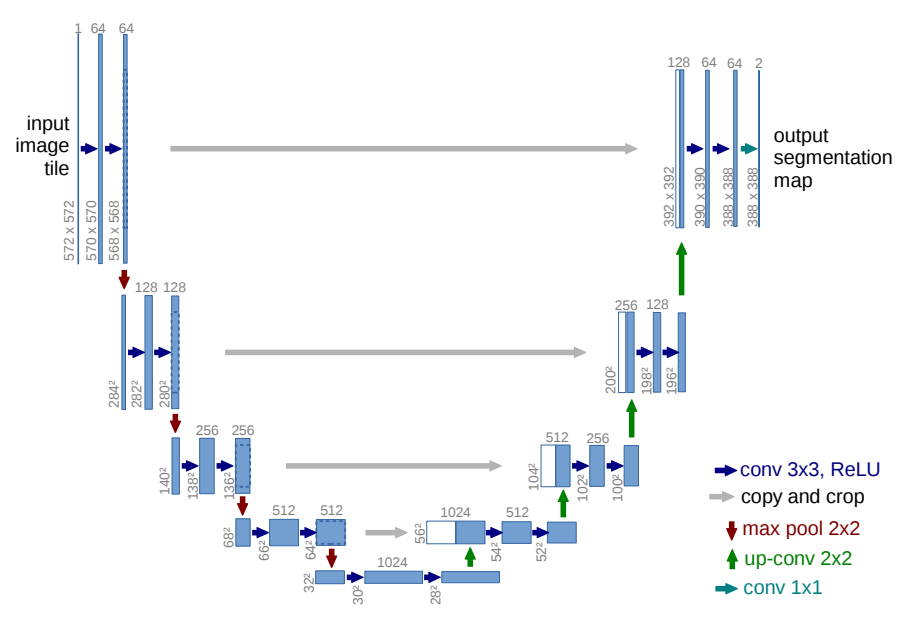
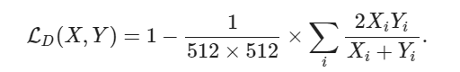
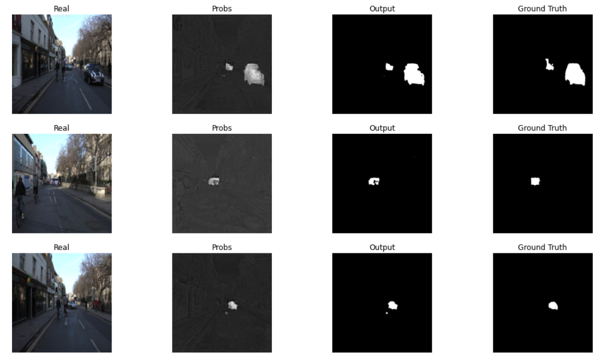
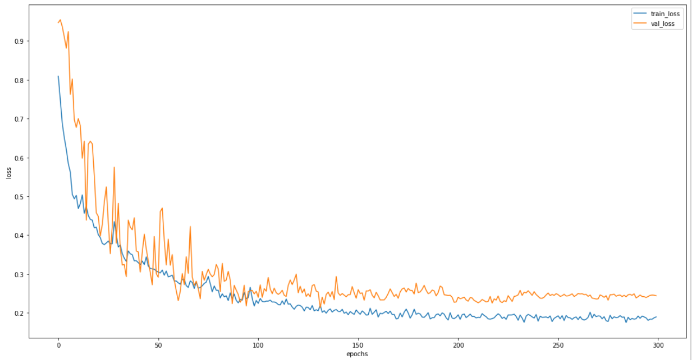

# Car Segmentation

End-to-end image segmentation with UNet

# Dataset

The Cambridge-driving Labeled Video Database (CamVid)

# Loss

Differentiable approximation of Dice Loss: 

# Model Reference

# Visualization of Loss Function

